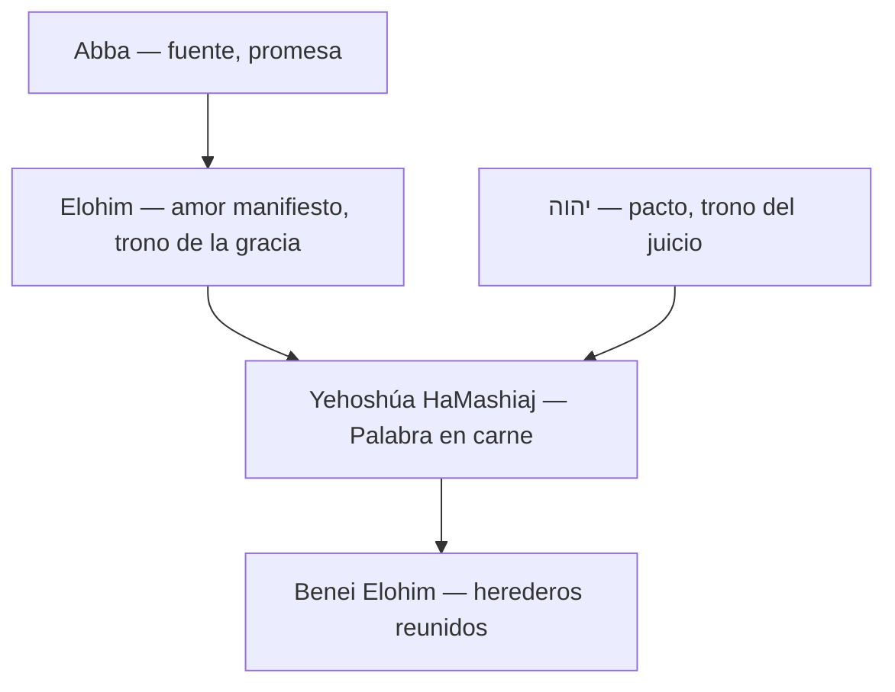

# Tesis

El evangelio de Yojanán no debe leerse trasladando al texto las categorías del castellano («Dios», «Padre», «hijo humano», «ángeles»). La serie de notas del repositorio propone leer desde términos semíticos: **Abba** como fuente de la promesa, **Elohim** como amor entrañable manifestado, **Ben HaAdam** y **Ben HaElohim** como títulos del Mesías portador de vida, **Benei Elohim** como herederos reunidos, **יהוה** como Nombre del pacto y trono del juicio, y **Yehoshúa HaMashiaj** como la Palabra corpórea del único Elohim que vive.

Esta nota condensa ese vocabulario en un solo mapa. No sustituye las notas de clase capítulo por capítulo; sirve como puerta de entrada y como índice conceptual.

## Alcance de la nota

- Fuente: síntesis de las notas de Yojanán y temas enlazados en `content/besorah/` y `content/temas/`.
- No reproduce transcripciones de video palabra por palabra.
- Los términos **El Chai** y **Bar El Chai** no aparecen como lección independiente en la serie; aquí se explican desde el hilo de «vida» y «Hijo» que recorre Yojanán.
- Cada palabra cambia de matiz según el pasaje; esta nota da el sentido dominante en la serie, no un diccionario cerrado.

## Regla de lectura

| Error frecuente | Lectura que propone la serie |
| --- | --- |
| «Padre» = otra persona divina separada del Hijo | Abba = fuente, promesa, amor aún no del todo revelado |
| «Dios» = etiqueta genérica fija | Elohim = matiz según contexto; a menudo amor entrañable manifiesto |
| «Hijo del hombre» = humano caído como nosotros | Ben HaAdam = entidad viviente con origen celestial |
| «Hijos de Dios» = ángeles siempre | Benei Elohim en Yojanán 11 = herederos reunidos del trono de la gracia |
| Orar al cielo = hablar con otro dios superior | Presentación ante tronos e institucionalidad divina |

## Mapa de relación

## Hoja léxica resumen

| Término | Transliteración | Sentido en la serie de Yojanán | Observación |
| --- | --- | --- | --- |
| **(אבא)** | Abba / Aba | Fuente, origen, palabra instituida, promesa | No figura separada en competencia con el Mesías |
| **(אלהים)** | Elohim | Amor entrañable manifestado; también juez, mensajero o uso polémico según contexto | No aplanar a «Dios» castellano |
| **(רחמים)** | rajamim | Afecto de entrañas ligado a Elohim | No reducir a «misericordia» como lástima |
| **(בן האדם)** | Ben HaAdam | Entidad viviente; postrer Adam de arriba | Arameo: Bar Enash; no naturaleza pecaminosa |
| **(בן האלהים)** | Ben HaElohim | Hijo, heredero, manifestación visible de la deidad | Arameo: Bar Elohim |
| **(בני האלהים)** | Benei Elohim | Herederos del trono de la gracia, dispersos reunidos en uno | Yojanán 11:52; no siempre «ángeles» |
| **(אל חי)** | El Chai | Elohim viviente: da vida, no está sujeto a muerte | Concepto implícito en toda la serie |
| **(יהוה)** | YHWH | Nombre del pacto; trono del juicio; justicia | Escribir יהוה; no fijar pronunciación |

## Abba (Aba)

**Abba** es palabra aramea del Segundo Templo. En la serie no nombra primero a un «papá» doméstico ni a una segunda persona divina.

Significa:

- **Fuente** y origen del amor entrañable antes de manifestarse (#tehilim_36_10; [[../temas/elohim_aba|Elohim y Aba]]).
- **Plenitud de la promesa** que el Mesías confiesa y cumple, no un interlocutor ajeno (#iojanan_11_41; [[yojanan_oracion_dos_tronos_emunah|Dos tronos y Abba instituido]]).
- **Voluntad escrita sobre el Mesías** — vino a hacer lo que estaba en el rollo, no a cumplir abstractamente «toda la ley» como cliché pastoral.

Cuando Yeshúa dice «el que me ha visto ha visto al Padre» (#iojanan_14_9), la serie lee: **ver al Mesías es ver el amor de Elohim hecho visible**, no ir hacia otra persona distante.

«Abba es mayor que yo» (#iojanan_14_28) no niega la deidad del Mesías. Distingue la **manifestación en etapa de siervo** de la **plenitud de la fuente** aún por revelarse del todo ([[yojanan_10_abba_obras_y_morada|Yojanán 10: Abba, obras y morada]]).

## Elohim

**Elohim** no equivale automáticamente al «Dios» genérico del castellano ni al θεός griego clásico.

En el uso principal de la serie:

- Es el **amor entrañable (rajamim) de Eloha manifestado** hacia la creación.
- Se relaciona con el **trono de la gracia**: misericordia, acceso, socorro oportuno (#ivrim_4_16; [[yojanan_oracion_dos_tronos_emunah|Dos tronos]]).

Pero el contexto manda. En Yojanán 10, `elohim` también puede nombrar jueces humanos (#tehilim_82_6), mensajeros o usos polémicos ([[yojanan_10_elohim_obras_y_mensajero|Yojanán 10: Elohim, obras y mensajero]]). La lectura no debe ser mecánica.

En el prólogo, la afirmación decisiva es #iojanan_1_1: **«Elohim era la Palabra»** — la meymrá no es un dios secundario ni un logos filosófico desligado; es la expresión corpórea del único Elohim ([[yojanan_1|Yojanán 1: meymrá y vida]], [[yojanan_iehudim_y_logos|Yojanán: yehudim y logos]]).

## Bar Enash / Ben HaAdam (בן האדם)

**Ben HaAdam** (hebreo) y **Bar Enash** (arameo) no significan «un humano caído como nosotros».

La serie distingue dos órdenes de **adam** (entidad viviente):

| Adam | Origen | Resultado |
| --- | --- | --- |
| Primero | Del polvo | Carne, sangre, corrupción, muerte |
| Postrer | De arriba del cielo | Vida indestructible, cuerpo de poder |

El Mesías es **Ben HaAdam** porque es entidad viviente real y corpórea, pero **no originado desde la corrupción** de la creación ([[../temas/ben_hijo_titulos_mesias|Ben, hijo y títulos del Mesías]], [[yojanan_9_ben_adam_y_el_ciego|Yojanán 9: Ben Adam y el ciego]]).

En Yojanán 6, comer la carne del Ben HaAdam es aceptar el **korban**: su vida entregada devuelve acceso a la vida del olam y al árbol de vida del que el primer adam quedó excluido ([[yojanan_6_pan_del_cielo_y_arbol_de_vida|Yojanán 6: pan vivo y árbol de vida]]).

## Ben HaElohim / Bar Elohim (בן האלהים)

**Ben HaElohim** no es hijo biológico de un dios separado. Es **portador, heredero y manifestación visible** de la deidad.

En la serie:

- Iojanán testifica: «Este es el Ben HaElohim» (#iojanan_1_34).
- El Hijo hace lo mismo que el Padre: vivifica, juzga, recibe la misma honra (#iojanan_5_19-23; [[yojanan_5_hijo_juicio_vida|Yojanán 5: Hijo, juicio y vida]]).
- Los oyentes de Yojanán 5:18 entienden que al decir que Elohim es su Padre, **se hace igual a Elohim** — la serie toma esa percepción como indicio textual serio, no como exageración.

«Hijo» viene del campo de **ben/bar**: herencia, pertenencia, portación. El Hijo no inventa una obra aparte; **hace visible la voluntad de יהוה**.

## Benei Elohim (בני האלהים)

En Yojanán 11:52 la serie lee **Benei Elohim** con cuidado gramatical: no solo «hijos de Dios» en sentido devocional moderno, sino **herederos del trono de la gracia y la misericordia**, dispersos que serán **congregados en uno**.

Eso enlaza con:

- el sacrificio del Mesías por **muchos** (remanente judío, ismaelitas, diez tribus, gentiles);
- el olivo natural (raíz = Mesías; ramas injertadas);
- la adopción: injertos en la promesa, no carrera de méritos farisaicos ([[yojanan_oracion_dos_tronos_emunah|Dos tronos y emunah]]).

**Advertencia:** en otros pasajes del Tanaj y del NT, `benei elohim` puede nombrar mensajeros o agentes celestiales. En Yojanán la serie prioriza el sentido de **herederos reunidos** en 11:52.

## La deidad de Yehoshúa HaMashiaj

Yojanán fue escrito, según la introducción de la serie, para mostrar la **dimensión divina del Mesías** ([[yojanan_introduccion|Introducción a Yojanán]]). No presenta a Yehoshúa como delegado menor, emanación distante ni ángel excelente.

### Hoja de comparación: anclas de deidad

| Referencia | Texto local | Función en la síntesis |
| --- | --- | --- |
| #iojanan_1_1 | בראשית היה הדבר… והוא הדבר היה אלהים (Delitzsch) | La Palabra es Elohim desde el origen |
| #iojanan_5_18 | …כי הוא דומה לאלהים (Delitzsch) | Se hace igual a Elohim |
| #iojanan_10_30 | ואני והאב אחד (Delitzsch) | Unidad de identidad y obra |
| #iojanan_14_9 | הראה אתי ראה אתהאב (Delitzsch) | Ver al Mesías = ver al Padre |
| #ivrim_6_13 | …נשבע בנפשו יען אשר אין גדול ממנו להשבע בו | יהוה juró por sí mismo; no hay mayor |
| #zejariah_12_10 | …והביטו אלי את אשר דקרו (OE) | El traspasado es manifestación de יהוה |

Pilares doctrinales en la serie:

1. **Corporeidad real** — la Palabra «llegó a ser carne» y tabernaculizó (#iojanan_1_14); no es apariencia ni sombra.
2. **Unidad con Abba** — no compiten; el Padre mora en el Mesías y obra por él (#iojanan_14_10).
3. **Cumplimiento personal** — יהוה no delega el sello final de las promesas en un inferior (#ivrim_6_13; [[yojanan_10_abba_obras_y_morada|Abba, obras y morada]]).
4. **Presentación celestial, no diálogo con otro dios** — cuando se dirige al cielo, entra en juicio y confiesa la promesa ([[yojanan_oracion_tribunal_celestial|Oración y tribunal celestial]]).

## Elohim viviente / El Chai (אל חי)

La serie no dedica una clase al término **El Chai** por separado, pero el concepto de **Elohim que vive y da vida** atraviesa todo Yojanán:

| Tema | Pasaje | Idea |
| --- | --- | --- |
| Vida en la Palabra | #iojanan_1_4 | En Él estaba la vida |
| Pan vivo | #iojanan_6_51 | Descendió del cielo; quien come no muere |
| Dominio sobre la vida | #iojanan_10_18 | Él pone y retoma su vida |
| Yo soy la vida | #iojanan_14_6 | Acceso a Abba unido a la vida misma |
| Hago morir y hago vivir | #devarim_32_39 | יהוה no delega plenitud de vida a criatura |

**Elohim viviente** es quien **no está limitado por la muerte**, vivifica a los muertos (#iojanan_5_21) y comunica vida olam por el Mesías.

## Bar El Chai / Ben HaElohim HaChai

**Bar El Chai** («Hijo del Elohim viviente») condensa dos títulos de la serie:

- **Ben HaElohim** — portador y manifestación de la deidad.
- **El Chai** — el que tiene vida en sí y la comunica.

En esta lectura, el Mesías **no recibe vida de otro dios**. Él es la **Palabra viviente** que descendió, entregó su carne como korban (#iojanan_6_51) y resucita con vida indestructible ([[yojanan_10_17_28_vida_indestructible|Vida indestructible]]).

La fórmula exacta **Ben HaElohim HaChai** no es eje explícito en las notas de Yojanán del repositorio; queda como síntesis léxica coherente con el hilo de vida + filiación.

## יהוה (el Tetragrammaton)

En contenido del repositorio se escribe **יהוה** y no se fijan pronunciaciones reconstruidas.

En la serie de Yojanán, יהוה cumple al menos dos funciones complementarias a Elohim:

| Aspecto | Elohim (en la serie) | יהוה |
| --- | --- | --- |
| Trono | Trono de la gracia | Trono del juicio |
| Énfasis | Misericordia, amor entrañable | Justicia, tribunal, Nombre del pacto |
| En Yojanán | Palabra manifestada, vida, korban | Ira sobre quien rechaza al Hijo (#iojanan_3_36); obra de salvación (#zejariah_12_10) |

No son dos dioses en competencia. Son **dos tronos de la misma institucionalidad divina** ([[yojanan_oracion_dos_tronos_emunah|Dos tronos]]).

Cuando Yeshúa se presenta «ante el cielo», la serie lee **presentación ante el trono del juicio**, no oración a un ser superior separado.

## Lectura integrada en un párrafo

יהוה prometió y juró por sí mismo. Su **Palabra** — **Elohim** manifestado — llegó a ser carne en **Yehoshúa HaMashiaj**. **Abba** nombra la fuente de esa promesa; el Mesías no habla con un Abba «otro», sino despliega y cumple lo prometido. Como **Ben HaElohim** y **Ben HaAdam**, porta vida, honra, juicio y korban del **Elohim viviente**. Su muerte reúne a los **Benei Elohim** dispersos como herederos del trono de la gracia. Todo el evangelio apunta a una conclusión: el Mesías no es un delegado menor, sino **יהוה/Elohim cumpliendo en persona lo jurado**.

## Conexiones principales

- [[yojanan_introduccion|Introducción al evangelio de Yojanán]] — hebraísmos y propósito del libro.
- [[yojanan_1|Yojanán 1: meymrá, vida y tabernáculo]] — Palabra = Elohim.
- [[yojanan_5_hijo_juicio_vida|Yojanán 5: Hijo, juicio y vida]] — Ben HaElohim y honra.
- [[yojanan_10_puerta_pastor_abba|Yojanán 10: puerta, pastor y Abba]] — Abba y promesa.
- [[yojanan_14_abba_menajem_nombre|Yojanán 14: Abba, Nombre y Menajem]] — camino, verdad, vida.
- [[yojanan_oracion_tribunal_celestial|Oración y tribunal celestial]] — dos tronos y presentación en juicio.
- [[../temas/elohim_aba|Elohim y Aba]] — léxico de fuente y manifestación.
- [[../temas/ben_hijo_titulos_mesias|Ben, hijo y títulos del Mesías]] — Adam y filiación.

## Pendiente de verificar

- [ ] Cotejar usos de **אל חי** / Bar El Chai en Besorah fuera de la serie Yojanán (p. ej. confesión mesiánica en otros evangelios).
- [ ] Revisar en léxicos el rango completo de **בני האלהים** en literatura intertestamentaria frente a la lectura de #iojanan_11_52.
- [ ] Desarrollar nota aparte sobre **יהוה צבאות** y plenitud de atributos si se enlaza con Yojanán 12:41.

## Conclusión

Leer Yojanán con estas palabras — Abba, Elohim, Ben HaAdam, Ben HaElohim, Benei Elohim, El Chai y יהוה — es leer el evangelio desde su propio mundo mental semítico. Si se aplanan al castellano, desaparece el argumento: un solo Elohim viviente que se manifestó en el Mesías, cumplió sus promesas en carne, dio vida a sus herederos y reunió en uno a los dispersos del trono de la gracia.

## Ver también

- [[yojanan_oracion_dos_tronos_emunah|Dos tronos, Abba instituido y emunah]]
- [[yojanan_10_elohim_obras_y_mensajero|Yojanán 10: Elohim, obras y mensajero]]
- [[yojanan_6_pan_del_cielo_y_arbol_de_vida|Yojanán 6: pan vivo y árbol de vida]]
- [[yojanan_9_ben_adam_y_el_ciego|Yojanán 9: Ben Adam y el ciego]]
- [[yojanan_11_eleazar_resurreccion_vida|Yojanán 11: Eleazar, resurrección y vida]]
- [[yojanan_10_emunah_obras_ovejas|Yojanán 10: emunah, obras y ovejas]]